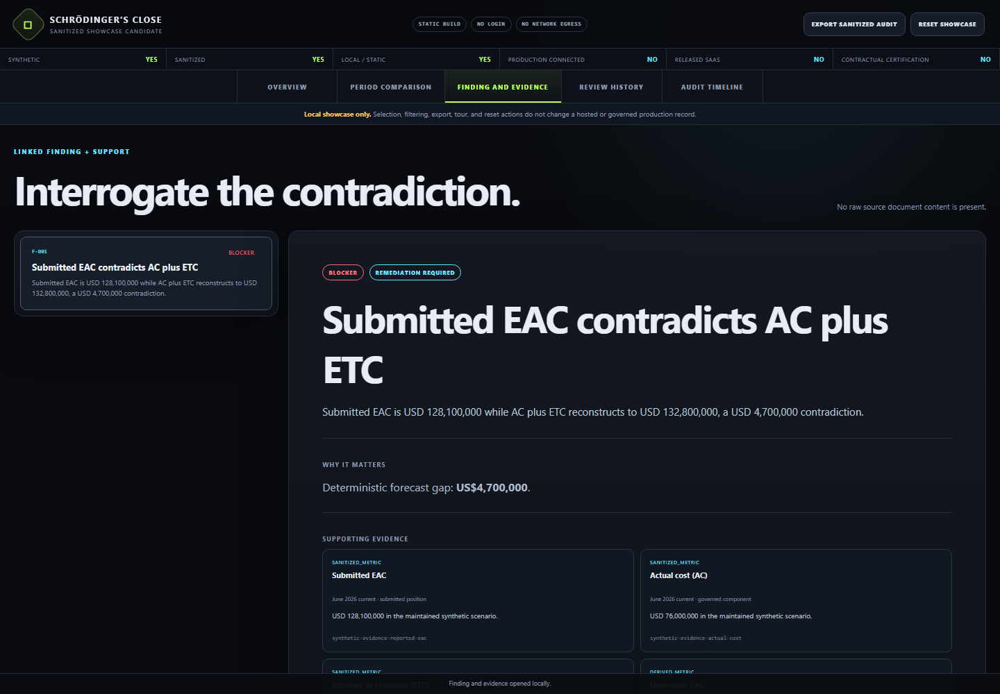

# Schrödinger’s Close · Interactive showcase

**What changed between reporting periods, and why is the close blocked?**

[Open the showcase](https://florianstuettgen.github.io/schroedingers-close-demo/)

Follow one synthetic project through a forecast discrepancy, the evidence supporting it, remediation review, and the recorded close decision. The demonstration makes the path behind the headline inspectable.



## A three-minute review

1. Start in **Overview** and select **Start guided demonstration**.
2. In **Period comparison**, compare the prior and current forecasts and select the material movement.
3. Open **Finding and evidence** to trace the discrepancy to its summarized supporting evidence.
4. Read **Review history** and **Audit timeline** to see why the close remains blocked.
5. Export the sanitized audit record, then reset the demonstration.

The tour navigates an existing example; it does not perform a live close or approve a project.

## What this demonstrates

- A review path from forecast movement to finding, evidence, and decision.
- A visible distinction between the analytical result and the recorded review history.
- A portable audit export and deterministic reset of the example.

All projects, periods, roles, figures, and evidence summaries are synthetic. This static viewer has no project-file intake, database connection, account, or production integration. It does not demonstrate authenticated approvals, contractual certification, or the completeness of a real forecast.

## Source and verification

The workbench source remains private. This repository contains only the separately verified static showcase and its deployment checks; it does not contain the workbench implementation, original source documents, or source history.

The six files in `site/` are the unchanged output of the maintained showcase build. `artifact-manifest.json` records their exact byte counts and SHA-256 hashes. The deployment workflow verifies that inventory before publishing only `site/`.

```bash
node scripts/verify-site.mjs
python -m http.server 4188 --directory site
```

Open `http://localhost:4188` to inspect the same static demonstration locally. Verification establishes artifact identity, not the truth of a real project's evidence.

[EQ-Proof: public forecast-assurance implementation](https://github.com/FlorianStuettgen/EQ-Proof) · [More projects by Florian Stuettgen](https://github.com/FlorianStuettgen)
